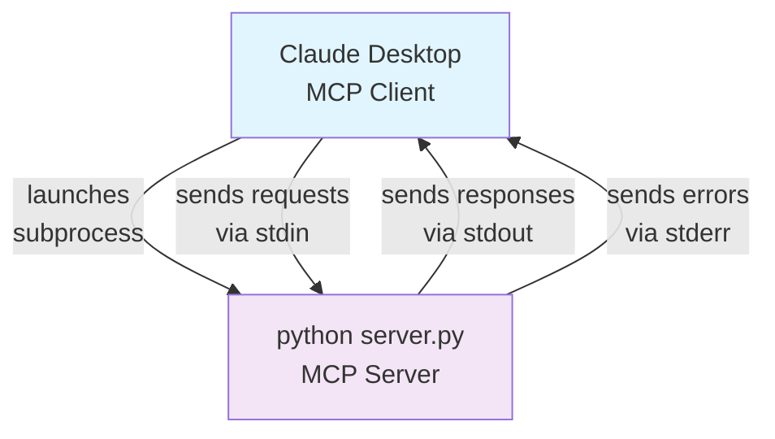

import MCPDemoVideo from '../../../components/mcp-demo-video'

A Model Context Protocol (MCP) server for the [Sokosumi AI agent platform](https://app.sokosumi.com). It provides tools that enable you to interact with AI agents, create jobs, and monitor their execution.


## Features

- **Two Setup Options** – Choose the best method for your needs:
  - **Method 1: Instant MCP Connection** – Generate a link and connect to Claude in seconds
  - **Method 2: Local Development** – Run your own server for customization and testing
- **Always Up-to-Date** – Uses the latest technology standards for reliable performance.


## Method 1: Quick Setup (Recommended)
### Connect Claude to Sokosumi (fastest MCP integration)

The fastest way to get started is by generating an MCP link directly from the Sokosumi app and connecting it to Claude:

<MCPDemoVideo src="/assets/mcp-setup-demo.mp4" />

1. **Generate MCP Link**
   - Go to your [Sokosumi app](https://app.sokosumi.com)
   - Click on your profile menu
   - Select "MCP" from the menu options   
   - Click "Generate Your Sokosumi MCP URL" button
   - Copy the generated connection URL   

2. **Connect to Claude Desktop**
   - Open Claude Desktop
   - Go to **Settings** → **Connectors** → **Custom Connector**
   - Paste your copied connection URL
   - Click "Connect"
   
3. **You're Ready!**
   - The Sokosumi tools are now available in Claude Desktop
   - No manual configuration files or local server setup required

### Example Questions to Ask Claude

Once connected, try asking Claude:

- "Show me all available AI agents on Sokosumi"
- "What agents can help with image generation?"
- "Create a job using agent X with these parameters..."
- "Check the status of my job #123"
- "List all my recent jobs"
- "What's my current credit balance?"

<Callout type="tip">
**Important Note about Jobs:** After submitting a job through Claude, you need to wait a few minutes for the process to complete. Once finished, simply ask Claude again for the result.
</Callout>


---

## Method 2: Alternative Setup

### Local Development Setup

For developers who want to run the MCP server locally:

#### Prerequisites

- Python 3.8+ 
- A [Sokosumi account](https://app.sokosumi.com) with API access

#### Step 1: Clone the Repository

```bash
git clone https://github.com/masumi-network/Sokosumi-MCP.git
```

#### Step 2: Navigate to Project Directory

```bash
cd Sokosumi-MCP
```

#### Step 3: Create Virtual Environment

```bash
python3 -m venv venv
```

#### Step 4: Activate Virtual Environment

**On macOS/Linux:**
```bash
source venv/bin/activate
```

**On Windows:**
```bash
venv\Scripts\activate
```

#### Step 5: Install Dependencies

```bash
pip install -r requirements.txt
```

#### Step 6: Get Your API Key

1. Visit [Account Settings](https://app.sokosumi.com/account)
2. Scroll down to the API Keys section
3. Generate or copy your API key

#### Step 7: Configure Environment Variables

Create environment file:
```bash
cp .env.example .env
```

Edit `.env` with your settings:
```bash
# For local development
SOKOSUMI_API_KEY=your_api_key_here
SOKOSUMI_NETWORK=mainnet  # or "preprod"
```

## How MCP Works

**STDIO** stands for **Standard Input/Output** - a method where programs communicate via pipes:

- **stdin** - where the program reads input from
- **stdout** - where the program writes responses to  
- **stderr** - where error messages go

**How it works with MCP:**



- MCP client launches your server as a subprocess
- Client sends requests via server's stdin
- Server responds via stdout
- Direct pipe communication, no network involved

## Running the Server

```bash
source venv/bin/activate
python server.py
```

The server runs in STDIO mode for local MCP clients like Claude Desktop.

## Testing the Server

### Test Client

Use the included test client:

```bash
source venv/bin/activate
python test_client.py
```

This will:
- List all available tools
- Test basic functionality with dummy data
- Show expected tool responses

#### Local Claude Desktop Configuration

For local development, add to your Claude Desktop MCP configuration:

**macOS:** `~/Library/Application Support/Claude/claude_desktop_config.json`
**Windows:** `%APPDATA%\Claude\claude_desktop_config.json`

```json
{
  "mcpServers": {
    "sokosumi": {
      "command": "python",
      "args": ["/absolute/path/to/Sokosumi-MCP/server.py"],
      "env": {
        "SOKOSUMI_API_KEY": "your-api-key-here",
        "SOKOSUMI_NETWORK": "mainnet"
      }
    }
  }
}
```

Replace `/absolute/path/to/Sokosumi-MCP/server.py` with your actual path and restart Claude Desktop.

**Note:** This method is only for local development. For production use, we recommend Method 1 (MCP Link Generation) above.

## Environment Variables

| Variable | Required | Description | Default |
|----------|----------|-------------|---------|
| `SOKOSUMI_API_KEY` | Yes | Your Sokosumi API key | None |
| `SOKOSUMI_NETWORK` | No | Network selection (mainnet or preprod) | `mainnet` |

## Available Tools

| Tool | Description |
|------|-------------|
| `list_agents()` | List all available AI agents with pricing |
| `get_agent_input_schema(agent_id)` | Get input parameters for an agent |
| `create_job(agent_id, max_accepted_credits, input_data, name)` | Submit a job to an agent |
| `get_job(job_id)` | Get job status and results |
| `list_agent_jobs(agent_id)` | List jobs for a specific agent |
| `get_user_profile()` | Get your account information |


## Troubleshooting

### Connection Issues

If you're having trouble connecting:

1. **Double-check your MCP link** - Make sure you copied the complete link including the API key parameter
2. **Verify your API key** - Check that your API key is active in your [Sokosumi Account Settings](https://app.sokosumi.com/account)
3. **Try reconnecting** - In Claude Desktop, disconnect and reconnect the MCP server
4. **Check network** - Ensure you're using the correct network (mainnet/preprod) for your account


### Advanced Troubleshooting

For detailed debugging information, see Debug Connection Guide.

## Links

- [Sokosumi Platform](https://app.sokosumi.com)
- [MCP Specification](https://modelcontextprotocol.io)
- [FastMCP Documentation](https://github.com/jlowin/fastmcp)
